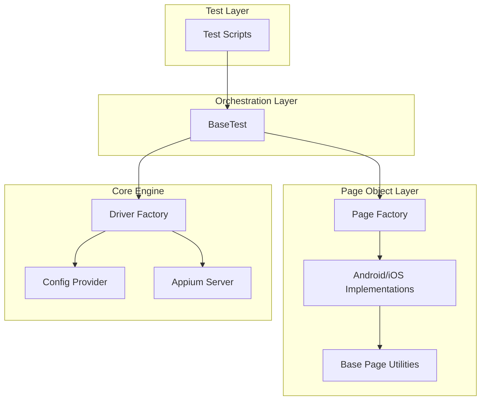

# 📱 Modular Mobile Automation Framework

<p align="center">
  
  
  
  
  
</p>

---

## 🌟 Overview

Welcome to the **Modular Mobile Automation Framework**! This is a state-of-the-art, high-performance automation solution built using **Java** and **Appium**. It is specifically engineered to handle cross-platform mobile testing (Android & iOS) with a single codebase, leveraging advanced design patterns for maximum maintainability and scalability.

By integrating **Allure Reporting**, **Log4j2**, and **FFmpeg**, this framework provides unmatched observability—including automatic screen recordings and comprehensive execution logs for every test run.

---

## 🎨 Stellar Features

*   **🎥 Smart Video Recording**: Every test run automatically records the device screen.
    *   *Pro Logic*: Uses `H.264` codec for iOS to ensure videos play instantly in any web browser without compatibility issues.
*   **📋 Deep Observability with Log4j2**: No more guessing what happened.
    *   *Pro Logic*: Framework-level logs are automatically captured and attached to the Allure report as a text file for every test.
*   **🖼️ Visual Evidence**: Automatic high-definition screenshots captured at the end of every test—categorized by **Success** or **Failure**.
*   **🌉 Cross-Platform Harmony**: Write one test script; run it on both Android and iOS. 
    *   Powered by the **Factory Design Pattern**, the framework dynamically picks the right locators for the right platform at runtime.
*   **🛡️ Defensive Architecture**: Built-in try-catch "Safety Shields" ensure that minor environmental issues (like missing FFmpeg) don't crash your entire test suite.
*   **🚀 Automated Cleanup**: Every test run starts with a clean slate. Old reports are automatically purged to prevent "ghost results."

---

## 🛠️ Performance Tech Stack

| Icon | Technology | Purpose |
| :---: | :--- | :--- |
| ☕ | **Java 17** | The robust backbone of the framework. |
| 📱 | **Appium 9.4.0** | The industry-standard engine for mobile automation. |
| 🧪 | **TestNG 7.10** | Advanced test orchestration and powerful annotations. |
| 📊 | **Allure 3.0.1** | Premium, interactive visual reporting. |
| 📝 | **Log4j2** | Enterprise-grade structured logging. |
| 🐘 | **Gradle 9+** | High-speed build and dependency management. |

---

## 🏗️ Core Architecture & Design Patterns

The framework is built on four fundamental pillars:

### 1. **Singleton-Hybrid Driver Factory**
Located in `DriverFactory.java`, this manages the lifecycle of the `AppiumDriver`. It handles platform-specific capabilities dynamically and ensures only one driver instance is active per thread.

### 2. **Dynamic Config Provider**
The `ConfigProvider.java` reads `.properties` files from `src/test/resources/config/`. It is smart enough to detect empty strings or missing properties and defaults to safe values, preventing runtime crashes.

### 3. **Page Factory Design Pattern**
We don't use `if-else` blocks inside our tests. Instead, we call `PageFactory.getLoginPage()`. The factory checks the platform and gives you the correct object implementation (`AndroidLoginPage` or `IOSLoginPage`).

### 4. **BaseTest Orchestration**
The `BaseTest.java` is the "Command Center." It orchestrates the setup (Starting recording, launching app) and the teardown (Stopping recording, saving logs, attaching screenshots) for every single test.



---

## 📂 Project Visual Map

A clean, modular structure designed for clarity:

```text
📂 modular-mobile-automation-framework
├── 📂 src
│   ├── 📂 main/java/core
│   │   ├── 📄 ConfigProvider.java   # 🧠 The configuration brain
│   │   └── 📄 DriverFactory.java    # 🏎️ The driver engine
│   └── 📂 test/java
│       ├── 📂 base
│       │   └── 📄 BaseTest.java      # 🏗️ Setup/Teardown orchestration
│       ├── 📂 pages
│       │   ├── 📂 common            # 🤝 Shared interfaces
│       │   ├── 📂 android           # 🤖 Android-specific locators
│       │   └── 📂 ios               # 🍎 iOS-specific locators
│       ├── 📂 tests                 # 🎯 Business logic scripts
│       └── 📂 utils
│           └── 📄 PageFactory.java   # 🌉 The platform bridge
├── 📂 src/test/resources
│   ├── 📂 apps                      # 📦 Mobile binaries (.apk, .app)
│   ├── 📂 config                    # ⚙️ Appium Capabilities
│   └── 📄 log4j2.xml                # 📝 Log routing configuration
├── 📄 build.gradle                  # 🛠️ Dependencies & Allure config
└── 📄 INTERVIEW_QA.md               # 🎓 The Interview Masterclass
```

---

## 🏃‍♂️ How to Run & Use

### 1️⃣ Prerequisites
*   **Appium 2.x**: `npm install -g appium`
*   **Drivers**: `appium driver install uiautomator2 xcuitest`
*   **FFmpeg**: (Crucial for iOS Videos) `brew install ffmpeg`
*   **Java 17**: Ensure `JAVA_HOME` is set.

### 2️⃣ Run Tests
Execute from your terminal with simple arguments:

```bash
# Run on Android (Default)
./gradlew clean test

# Run on iOS explicitly
./gradlew clean test -Dplatform=iOS
```

### 3️⃣ View the Magic (Reporting)
Generate and open the interactive Allure report:
```bash
./gradlew allureServe
```

---


---

## 🤖 CI/CD Evolution (GitHub Actions)

This framework isn't just code—it's a production-ready **CI/CD Pipeline**.

### **Pipeline Workflow (`mobile-tests.yml`):**
*   **Infrastructure-as-Code**: Automatically sets up Java, Node.js, Appium, and Android Emulators using hardware acceleration (KVM).
*   **Robust Lifecycle**: Uses optimized cleanup logic (`pkill -x appium`) to ensure the server starts and stops cleanly every time.
*   **GitHub Pages Deployment**: Every successful or failed run triggers an automatic deployment of the Allure Report to GitHub Pages.
*   **🚀 Real-time Telegram Notifications**: The framework sends an instant message to your team on Telegram as soon as tests finish, including:
    *   **Build Status** (Success/Failure)
    *   **Clickable Report Link** for instant troubleshooting.

### **Security First**
All sensitive data (Telegram Tokens, Chat IDs) are managed via **GitHub Repository Secrets** and mapped to the environment at runtime, ensuring complete security.

---

## 🎓 SDET Interview Masterclass

Building the framework is only half the battle. Explaining it is the other half. 
We have documented **45+ Senior SDET interview questions** and detailed answers based on this exact framework. It covers everything from **Appium Architecture** to **Advanced Observability**.

👉 **[Launch the Interview Q&A Guide](INTERVIEW_QA.md)** 👈

---

## 📈 Recent Major Updates

*   ✅ **Ultra-Compatible iOS Video**: Switched to `h264` codec for flawless Allure playback.
*   ✅ **Zero-Crash Recording**: Added "Safety Shield" try-catch blocks for video recording.
*   ✅ **Integrated Audit Trail**: Log4j2 logs now automatically bundle with Allure test results.
*   ✅ **Smart Cleanup**: Automated result purging in `build.gradle` to ensure data integrity.

---

<p align="center">
  Built with ❤️ by <b>Abhinav</b> for High-Performance Quality Engineering.
</p>
